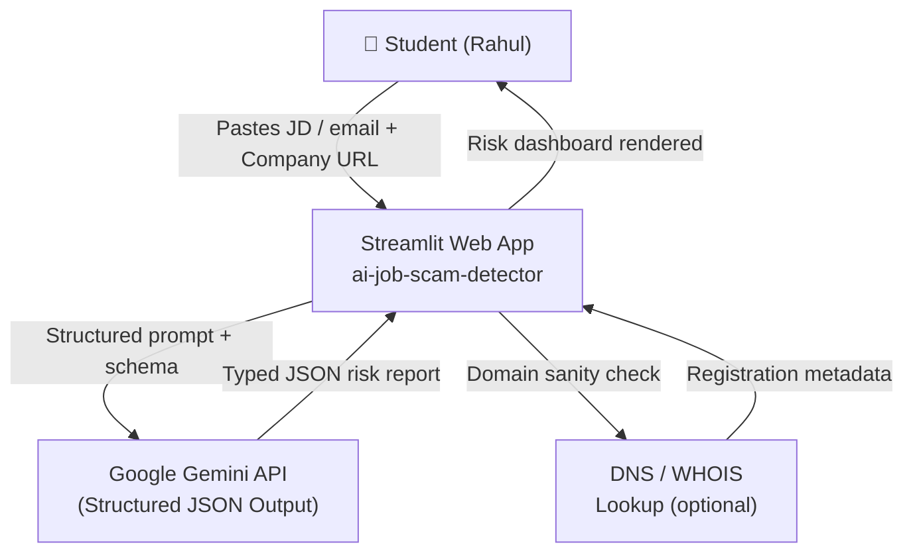
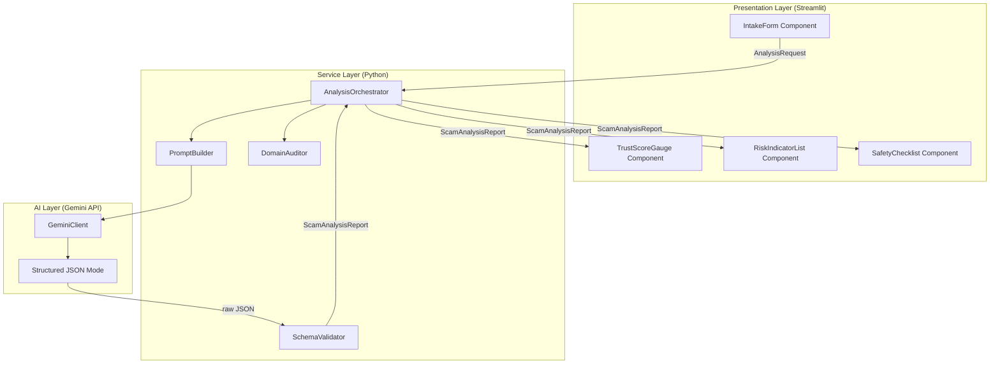
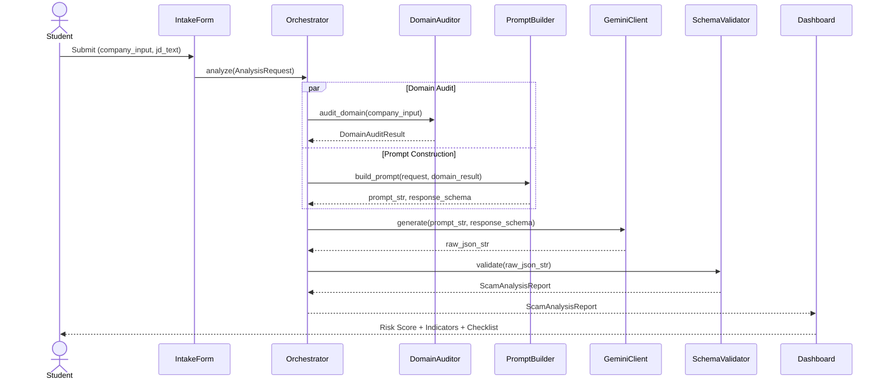
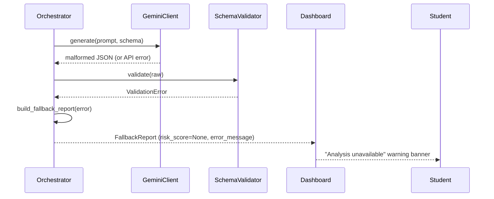

# Design Document: AI Job Scam Detector

## Overview

The AI Job Scam Detector is a full-stack web application built for the "AI for Impact" Hackathon under the "AI for Employability" theme. It targets college students like Rahul who are actively hunting for internships on platforms like LinkedIn, Telegram, and Internshala, and are vulnerable to fake recruitment pipelines, high-pressure "urgent hiring" tactics, and upfront security fee scams.

The system accepts a company name/URL and a pasted job description or email correspondence. It then routes this input through a Google Gemini-powered multi-agent analysis pipeline that evaluates linguistic red flags, domain/metadata anomalies, and high-pressure semantic patterns. The result is synthesized into a structured JSON risk report rendered as a live Streamlit dashboard — showing a color-coded Job Trust Score, categorized Detected Risk Indicators, and an actionable Student Safety checklist.

The entire stack is Python-native: Streamlit for the frontend, Python 3 for backend orchestration, and the Gemini API with enforced structured JSON output for the AI analysis layer.

---

## Architecture

### System Context



### Application Layers



---

## Sequence Diagrams

### Main Analysis Flow



### Error / Fallback Flow



---

## Components and Interfaces

### Component 1: IntakeForm

**Purpose**: Collects company name/URL and the raw job description or email text from the student.

**Interface**:
```python
def render_intake_form() -> Optional[AnalysisRequest]:
    """
    Renders the Streamlit intake UI.
    Returns an AnalysisRequest when the user submits, or None while idle.
    """
```

**Responsibilities**:
- Render text inputs for company name/URL and job description textarea
- Validate that neither field is empty before allowing submission
- Return a structured `AnalysisRequest` dataclass on submit
- Display character count and input guidance for Rahul

---

### Component 2: AnalysisOrchestrator

**Purpose**: Central coordinator that sequences domain audit, prompt construction, Gemini API call, and schema validation into a single pipeline execution.

**Interface**:
```python
def analyze(request: AnalysisRequest) -> ScamAnalysisReport:
    """
    Runs the full multi-step analysis pipeline.
    Raises AnalysisError on unrecoverable failure.
    """
```

**Responsibilities**:
- Coordinate concurrent domain audit and prompt building
- Pass structured prompt and schema to GeminiClient
- Invoke SchemaValidator on raw API response
- Construct a `FallbackReport` if any stage fails
- Emit structured logs for each pipeline stage

---

### Component 3: PromptBuilder

**Purpose**: Constructs the system + user prompt that instructs Gemini to act as a multi-agent scam evaluator, embedding the input data and enforcing the output schema.

**Interface**:
```python
def build_prompt(
    request: AnalysisRequest,
    domain_result: DomainAuditResult,
) -> tuple[str, dict]:
    """
    Returns (prompt_text, response_schema_dict).
    response_schema_dict is the JSON Schema object passed to Gemini's
    response_mime_type="application/json" structured output mode.
    """
```

**Responsibilities**:
- Embed company name/URL and JD text into a role-scoped prompt
- Inject `DomainAuditResult` facts (age, HTTPS status, WHOIS flags) into context
- Define and return the strict JSON schema for Gemini's response
- Apply prompt versioning so experiments are trackable

---

### Component 4: GeminiClient

**Purpose**: Thin wrapper around the `google-generativeai` SDK that enforces structured JSON output mode and applies retry logic.

**Interface**:
```python
def generate(prompt: str, response_schema: dict) -> str:
    """
    Calls Gemini API with structured output enforcement.
    Returns raw JSON string.
    Raises GeminiAPIError after max_retries exhausted.
    """
```

**Responsibilities**:
- Configure `generation_config` with `response_mime_type="application/json"` and the schema
- Apply exponential backoff retry (max 3 attempts) on transient HTTP errors
- Enforce a configurable token budget (`max_output_tokens`)
- Sanitize and return the raw JSON string for downstream validation

---

### Component 5: SchemaValidator

**Purpose**: Parses and validates the raw JSON string from Gemini against the `ScamAnalysisReport` Pydantic model, ensuring type-safe downstream rendering.

**Interface**:
```python
def validate(raw_json: str) -> ScamAnalysisReport:
    """
    Parses raw_json into ScamAnalysisReport.
    Raises SchemaValidationError with details on mismatch.
    """
```

**Responsibilities**:
- Parse raw JSON string into a Python dict
- Validate all required fields are present and correctly typed
- Clamp `risk_score` to [0, 100] if Gemini drifts out of range
- Return a fully-populated `ScamAnalysisReport` dataclass

---

### Component 6: DomainAuditor

**Purpose**: Performs lightweight URL/domain sanity checks before the AI call to surface obvious structural red flags (free email domains, HTTP-only URLs, very new domains).

**Interface**:
```python
def audit_domain(company_input: str) -> DomainAuditResult:
    """
    Extracts domain from company_input (URL or plain name),
    performs basic metadata checks.
    Never raises — returns DomainAuditResult with is_auditable=False
    if the input cannot be parsed as a URL.
    """
```

**Responsibilities**:
- Attempt URL parsing to extract the hostname
- Check whether the domain uses HTTPS
- Detect free email hosting domains (gmail.com, yahoo.com, outlook.com, etc.)
- Optionally perform a lightweight WHOIS lookup for domain age
- Return structured `DomainAuditResult` for inclusion in the Gemini prompt

---

### Component 7: Dashboard (Streamlit Rendering Components)

**Purpose**: Renders the `ScamAnalysisReport` as three distinct visual panels.

**Interface**:
```python
def render_trust_score_gauge(report: ScamAnalysisReport) -> None:
    """Renders the Job Trust Score Matrix with color-coded indicator."""

def render_risk_indicators(report: ScamAnalysisReport) -> None:
    """Renders the categorized Detected Risk Indicators list."""

def render_safety_checklist(report: ScamAnalysisReport) -> None:
    """Renders the dynamic Student Safety Next Steps checklist."""
```

**Responsibilities**:
- Map `risk_score` to Red (≥70) / Yellow (40–69) / Green (<40) visual states
- Render each `RiskIndicator` with its category badge and explanation
- Render each `SafetyStep` as a styled checklist item
- Handle `FallbackReport` by displaying a user-friendly error banner

---

## Data Models

### AnalysisRequest

```python
from dataclasses import dataclass

@dataclass
class AnalysisRequest:
    company_input: str   # Company name or URL pasted by student
    jd_text: str         # Raw job description or email text
```

**Validation Rules**:
- `company_input`: non-empty string, max 500 characters
- `jd_text`: non-empty string, min 50 characters, max 10,000 characters

---

### DomainAuditResult

```python
from dataclasses import dataclass
from typing import Optional

@dataclass
class DomainAuditResult:
    is_auditable: bool              # False if input is not a parseable URL
    domain: Optional[str]           # Extracted hostname, e.g. "careers.example.com"
    uses_https: Optional[bool]      # True if scheme is https://
    is_free_email_domain: bool      # True if domain in [gmail.com, yahoo.com, ...]
    domain_age_days: Optional[int]  # None if WHOIS lookup skipped or failed
    flags: list[str]                # Human-readable flag strings for prompt injection
```

---

### RiskIndicator

```python
from dataclasses import dataclass
from enum import Enum

class RiskCategory(str, Enum):
    LINGUISTIC    = "linguistic"      # High-pressure language, urgency cues
    FINANCIAL     = "financial"       # Upfront fees, security deposits
    DOMAIN        = "domain"          # Suspicious URL/email patterns
    IDENTITY      = "identity"        # Requests for sensitive personal data
    PROCESS       = "process"         # Unusual hiring workflow steps
    COMPENSATION  = "compensation"    # Unrealistic salary/rate claims

@dataclass
class RiskIndicator:
    category: RiskCategory
    indicator: str       # Short label, e.g. "Upfront Security Deposit Requested"
    explanation: str     # 1-2 sentence explanation for the student
    severity: str        # "high" | "medium" | "low"
    evidence_quote: str  # Direct quote or phrase from the input that triggered this
```

---

### SafetyStep

```python
from dataclasses import dataclass

@dataclass
class SafetyStep:
    action: str          # Short imperative, e.g. "Do not submit PAN card details"
    reason: str          # Why this action protects the student
    priority: str        # "urgent" | "recommended" | "informational"
```

---

### ScamAnalysisReport

```python
from dataclasses import dataclass, field
from typing import Optional

@dataclass
class ScamAnalysisReport:
    risk_score: int                        # 0–100 (100 = definitely a scam)
    risk_label: str                        # "HIGH RISK" | "MEDIUM RISK" | "LOW RISK"
    summary: str                           # 1-sentence verdict for the student
    risk_indicators: list[RiskIndicator]   # Categorized flags
    safety_steps: list[SafetyStep]         # Actionable checklist
    confidence: str                        # "high" | "medium" | "low" — AI confidence
    analysis_version: str                  # Prompt/schema version tag
    is_fallback: bool = False              # True if constructed from error recovery
    error_message: Optional[str] = None   # Populated only on fallback
```

---

### JSON Schema (Enforced in Gemini API Call)

```python
SCAM_ANALYSIS_SCHEMA = {
    "type": "object",
    "properties": {
        "risk_score": {"type": "integer", "minimum": 0, "maximum": 100},
        "risk_label": {"type": "string", "enum": ["HIGH RISK", "MEDIUM RISK", "LOW RISK"]},
        "summary": {"type": "string"},
        "confidence": {"type": "string", "enum": ["high", "medium", "low"]},
        "analysis_version": {"type": "string"},
        "risk_indicators": {
            "type": "array",
            "items": {
                "type": "object",
                "properties": {
                    "category": {
                        "type": "string",
                        "enum": ["linguistic", "financial", "domain",
                                 "identity", "process", "compensation"]
                    },
                    "indicator": {"type": "string"},
                    "explanation": {"type": "string"},
                    "severity": {"type": "string", "enum": ["high", "medium", "low"]},
                    "evidence_quote": {"type": "string"}
                },
                "required": ["category", "indicator", "explanation",
                             "severity", "evidence_quote"]
            }
        },
        "safety_steps": {
            "type": "array",
            "items": {
                "type": "object",
                "properties": {
                    "action": {"type": "string"},
                    "reason": {"type": "string"},
                    "priority": {"type": "string",
                                 "enum": ["urgent", "recommended", "informational"]}
                },
                "required": ["action", "reason", "priority"]
            }
        }
    },
    "required": ["risk_score", "risk_label", "summary", "confidence",
                 "analysis_version", "risk_indicators", "safety_steps"]
}
```

---

## Algorithmic Pseudocode

### Main Orchestration Algorithm

```pascal
ALGORITHM analyze(request: AnalysisRequest) → ScamAnalysisReport
INPUT:  request  — validated AnalysisRequest (company_input, jd_text)
OUTPUT: report   — ScamAnalysisReport

BEGIN
  ASSERT request.company_input IS NOT EMPTY
  ASSERT LENGTH(request.jd_text) >= 50

  // Stage 1: Run domain audit (non-blocking, never raises)
  domain_result ← DomainAuditor.audit_domain(request.company_input)

  // Stage 2: Build prompt + schema
  (prompt, schema) ← PromptBuilder.build_prompt(request, domain_result)

  // Stage 3: Call Gemini with retry logic
  TRY
    raw_json ← GeminiClient.generate(prompt, schema)
  CATCH GeminiAPIError AS e
    RETURN build_fallback_report(error=e)
  END TRY

  // Stage 4: Validate and parse response
  TRY
    report ← SchemaValidator.validate(raw_json)
  CATCH SchemaValidationError AS e
    RETURN build_fallback_report(error=e)
  END TRY

  ASSERT report.risk_score IN [0, 100]
  ASSERT report.risk_label IN {"HIGH RISK", "MEDIUM RISK", "LOW RISK"}

  RETURN report
END
```

**Preconditions:**
- `request.company_input` is a non-empty string
- `request.jd_text` is at least 50 characters

**Postconditions:**
- Returns a fully-populated `ScamAnalysisReport` or a `FallbackReport` (never raises)
- `report.risk_score` is always in range [0, 100]
- `report.is_fallback` is True if and only if a pipeline error occurred

**Loop Invariants:** N/A (sequential pipeline, no loops)

---

### Gemini API Call with Exponential Backoff

```pascal
ALGORITHM generate(prompt: str, response_schema: dict) → str
INPUT:  prompt          — fully constructed prompt string
        response_schema — JSON Schema dict for structured output
OUTPUT: raw_json_str    — raw JSON string from Gemini

CONSTANTS:
  MAX_RETRIES ← 3
  BASE_DELAY  ← 1.0  // seconds

BEGIN
  attempt ← 0

  WHILE attempt < MAX_RETRIES DO
    ASSERT attempt >= 0

    TRY
      response ← gemini_model.generate_content(
        contents=prompt,
        generation_config={
          "response_mime_type": "application/json",
          "response_schema": response_schema,
          "max_output_tokens": 2048,
          "temperature": 0.2
        }
      )

      IF response.text IS NOT EMPTY THEN
        RETURN response.text
      END IF

      RAISE GeminiAPIError("Empty response received")

    CATCH TransientHTTPError AS e
      delay ← BASE_DELAY * (2 ^ attempt)
      SLEEP(delay)
      attempt ← attempt + 1
    CATCH FatalAPIError AS e
      RAISE GeminiAPIError(cause=e)  // do not retry
    END TRY
  END WHILE

  RAISE GeminiAPIError("Max retries exhausted")
END
```

**Preconditions:**
- `prompt` is a non-empty string
- `response_schema` is a valid JSON Schema dict
- Gemini API key is configured in environment

**Postconditions:**
- Returns a non-empty raw JSON string on success
- Raises `GeminiAPIError` after max retries or on fatal error

**Loop Invariants:**
- `attempt` increases by 1 on each iteration
- `delay` doubles on each retry (exponential backoff)
- All previous attempts failed with a transient error

---

### Domain Audit Algorithm

```pascal
ALGORITHM audit_domain(company_input: str) → DomainAuditResult
INPUT:  company_input — raw string (URL or company name)
OUTPUT: result        — DomainAuditResult

CONSTANTS:
  FREE_EMAIL_DOMAINS ← {
    "gmail.com", "yahoo.com", "outlook.com", "hotmail.com",
    "rediffmail.com", "ymail.com", "protonmail.com"
  }

BEGIN
  // Attempt URL parse
  parsed ← urllib.parse.urlparse(company_input)

  IF parsed.scheme NOT IN {"http", "https"} THEN
    RETURN DomainAuditResult(
      is_auditable=False, domain=None, uses_https=None,
      is_free_email_domain=False, domain_age_days=None,
      flags=["Input is not a URL — manual domain verification recommended"]
    )
  END IF

  domain ← parsed.hostname.lower()
  uses_https ← (parsed.scheme == "https")
  flags ← []

  IF NOT uses_https THEN
    flags.APPEND("URL uses HTTP, not HTTPS — insecure connection")
  END IF

  is_free_email ← (domain IN FREE_EMAIL_DOMAINS)
  IF is_free_email THEN
    flags.APPEND("Recruiter contact is a free email domain — red flag for corporate roles")
  END IF

  // Optional lightweight WHOIS (graceful skip on failure)
  domain_age ← None
  TRY
    whois_data ← whois.query(domain)
    IF whois_data.creation_date IS NOT None THEN
      domain_age ← (today() - whois_data.creation_date).days
      IF domain_age < 180 THEN
        flags.APPEND("Domain registered less than 6 months ago — very new, treat with caution")
      END IF
    END IF
  CATCH ANY
    // WHOIS lookup is best-effort; silently skip
  END TRY

  RETURN DomainAuditResult(
    is_auditable=True,
    domain=domain,
    uses_https=uses_https,
    is_free_email_domain=is_free_email,
    domain_age_days=domain_age,
    flags=flags
  )
END
```

**Preconditions:**
- `company_input` is a non-empty string

**Postconditions:**
- Always returns a valid `DomainAuditResult` (never raises)
- `is_auditable` is False if input cannot be parsed as a URL
- `flags` is an empty list if no anomalies are found

---

### Schema Validation Algorithm

```pascal
ALGORITHM validate(raw_json: str) → ScamAnalysisReport
INPUT:  raw_json — raw string from Gemini
OUTPUT: report   — validated ScamAnalysisReport

BEGIN
  // Parse JSON
  TRY
    data ← json.loads(raw_json)
  CATCH JSONDecodeError AS e
    RAISE SchemaValidationError("Invalid JSON from Gemini", cause=e)
  END TRY

  // Validate required top-level fields
  FOR each field IN REQUIRED_TOP_LEVEL_FIELDS DO
    IF field NOT IN data THEN
      RAISE SchemaValidationError("Missing required field: " + field)
    END IF
  END FOR

  // Clamp risk_score to [0, 100]
  data["risk_score"] ← MAX(0, MIN(100, int(data["risk_score"])))

  // Validate risk_label consistency
  expected_label ← derive_risk_label(data["risk_score"])
  IF data["risk_label"] != expected_label THEN
    data["risk_label"] ← expected_label  // self-heal label/score mismatch
  END IF

  // Parse nested lists
  indicators ← []
  FOR each item IN data["risk_indicators"] DO
    indicators.APPEND(parse_risk_indicator(item))
  END FOR

  steps ← []
  FOR each item IN data["safety_steps"] DO
    steps.APPEND(parse_safety_step(item))
  END FOR

  RETURN ScamAnalysisReport(
    risk_score=data["risk_score"],
    risk_label=data["risk_label"],
    summary=data["summary"],
    confidence=data["confidence"],
    analysis_version=data["analysis_version"],
    risk_indicators=indicators,
    safety_steps=steps
  )
END

FUNCTION derive_risk_label(score: int) → str
BEGIN
  IF score >= 70 THEN RETURN "HIGH RISK"
  IF score >= 40 THEN RETURN "MEDIUM RISK"
  RETURN "LOW RISK"
END
```

**Preconditions:**
- `raw_json` is a non-empty string

**Postconditions:**
- Returns a `ScamAnalysisReport` with all required fields populated
- `risk_score` is always in [0, 100]
- `risk_label` is always consistent with `risk_score`
- Raises `SchemaValidationError` only on unrecoverable parse failures

**Loop Invariants (indicator/step loops):**
- Each processed item is a valid `RiskIndicator` / `SafetyStep`
- Partially processed lists are discarded on error

---

### Risk Score → Risk Label Derivation

| `risk_score` Range | `risk_label`  | UI Color |
|--------------------|---------------|----------|
| 70 – 100           | HIGH RISK     | 🔴 Red   |
| 40 – 69            | MEDIUM RISK   | 🟡 Yellow|
| 0 – 39             | LOW RISK      | 🟢 Green |

---

## Key Functions with Formal Specifications

### `build_prompt(request, domain_result) -> tuple[str, dict]`

```python
def build_prompt(
    request: AnalysisRequest,
    domain_result: DomainAuditResult,
) -> tuple[str, dict]:
```

**Preconditions:**
- `request.jd_text` is at least 50 characters
- `domain_result` is a valid `DomainAuditResult` (may have `is_auditable=False`)

**Postconditions:**
- Returns a tuple `(prompt_str, schema_dict)` where both are non-empty
- `prompt_str` contains the full system + user message with injected data
- `schema_dict` equals `SCAM_ANALYSIS_SCHEMA`
- Domain flags from `domain_result.flags` are embedded in the prompt when non-empty

---

### `render_trust_score_gauge(report) -> None`

```python
def render_trust_score_gauge(report: ScamAnalysisReport) -> None:
```

**Preconditions:**
- `report.risk_score` is in [0, 100]
- `report.risk_label` is one of `{"HIGH RISK", "MEDIUM RISK", "LOW RISK"}`

**Postconditions:**
- A Streamlit metric + colored progress bar is rendered
- Color is Red if `risk_score >= 70`, Yellow if `40–69`, Green if `< 40`
- `report.summary` is displayed beneath the score
- No side effects outside of Streamlit render state

---

### `render_risk_indicators(report) -> None`

```python
def render_risk_indicators(report: ScamAnalysisReport) -> None:
```

**Preconditions:**
- `report.risk_indicators` is a list (may be empty)

**Postconditions:**
- Each `RiskIndicator` is rendered as an expandable card with:
  - Category badge (color-coded by category)
  - Indicator label and severity tag
  - Explanation text
  - Evidence quote in a styled blockquote
- Empty list renders a "No suspicious patterns detected" message

---

### `render_safety_checklist(report) -> None`

```python
def render_safety_checklist(report: ScamAnalysisReport) -> None:
```

**Preconditions:**
- `report.safety_steps` is a list (may be empty)

**Postconditions:**
- Each `SafetyStep` is rendered as a checklist row with:
  - Priority badge (Urgent / Recommended / Informational)
  - Action text in bold
  - Reason in muted text
- Steps sorted by priority: urgent → recommended → informational

---

## Example Usage

### End-to-End Analysis

```python
import streamlit as st
from orchestrator import AnalysisOrchestrator
from models import AnalysisRequest
from dashboard import (
    render_trust_score_gauge,
    render_risk_indicators,
    render_safety_checklist,
)

def main():
    st.set_page_config(
        page_title="AI Job Scam Detector",
        page_icon="🔍",
        layout="wide"
    )
    st.title("🔍 AI Job Scam Detector")
    st.caption("Protecting students from fake internship and job scams")

    with st.form("intake_form"):
        company_input = st.text_input(
            "Company Name or URL",
            placeholder="e.g. https://careers.example.com or 'TechCorp Solutions'"
        )
        jd_text = st.text_area(
            "Paste Job Description or Email",
            height=250,
            placeholder="Paste the full job description, WhatsApp message, or email here..."
        )
        submitted = st.form_submit_button("🔎 Analyze for Scam Risk")

    if submitted and company_input and jd_text:
        request = AnalysisRequest(
            company_input=company_input.strip(),
            jd_text=jd_text.strip()
        )

        with st.spinner("Analyzing with AI... this may take a few seconds"):
            orchestrator = AnalysisOrchestrator()
            report = orchestrator.analyze(request)

        if report.is_fallback:
            st.error(f"⚠️ Analysis unavailable: {report.error_message}")
        else:
            col1, col2 = st.columns([1, 2])
            with col1:
                render_trust_score_gauge(report)
            with col2:
                render_safety_checklist(report)

            st.divider()
            render_risk_indicators(report)

if __name__ == "__main__":
    main()
```

### GeminiClient Initialization

```python
import google.generativeai as genai
import os

class GeminiClient:
    def __init__(self):
        genai.configure(api_key=os.environ["GEMINI_API_KEY"])
        self.model = genai.GenerativeModel(
            model_name="gemini-1.5-flash",
            system_instruction=(
                "You are a cybersecurity and recruitment fraud expert. "
                "Your task is to analyze job postings and emails for signs of scams. "
                "You MUST respond only with valid JSON matching the provided schema. "
                "Focus on protecting vulnerable college students in India from employment fraud."
            )
        )

    def generate(self, prompt: str, response_schema: dict) -> str:
        import time
        max_retries = 3
        base_delay = 1.0

        for attempt in range(max_retries):
            try:
                response = self.model.generate_content(
                    contents=prompt,
                    generation_config=genai.GenerationConfig(
                        response_mime_type="application/json",
                        response_schema=response_schema,
                        max_output_tokens=2048,
                        temperature=0.2,
                    )
                )
                if response.text:
                    return response.text
                raise GeminiAPIError("Empty response from Gemini")
            except Exception as e:
                if attempt < max_retries - 1:
                    time.sleep(base_delay * (2 ** attempt))
                else:
                    raise GeminiAPIError(str(e)) from e
```

### Prompt Template

```python
PROMPT_TEMPLATE = """
You are analyzing a job posting for potential fraud signals. 
A college student in India has submitted the following for review.

=== COMPANY / SOURCE ===
{company_input}

=== DOMAIN AUDIT FLAGS ===
{domain_flags}

=== JOB DESCRIPTION / EMAIL TEXT ===
{jd_text}

=== ANALYSIS INSTRUCTIONS ===
Evaluate this submission across ALL of the following fraud dimensions:

1. LINGUISTIC: High-pressure urgency ("apply immediately", "limited seats"), 
   vague role descriptions, grammatical inconsistencies.

2. FINANCIAL: Any mention of deposits, fees, equipment purchases, 
   security amounts, or payment before joining. 
   Flag phrases like "₹500 registration fee", "refundable security deposit".

3. COMPENSATION: Unrealistic salary claims for entry-level roles 
   (e.g., "₹50,000/week for data entry", "earn ₹1 lakh from home").

4. IDENTITY: Requests for Aadhaar, PAN card, bank account details, 
   or passport copies at initial application stage.

5. DOMAIN: Use the Domain Audit Flags above. Also flag if the contact 
   email uses free providers (Gmail, Yahoo) for what claims to be a corporate role.

6. PROCESS: Unusual hiring steps — WhatsApp interviews only, 
   no formal offer letter, immediate joining demand, 
   "work from home data entry" with no skill requirements.

Assign a risk_score from 0 (completely legitimate) to 100 (definite scam).
Generate specific, actionable safety_steps tailored to this exact submission.
Use Indian context — reference PAN card, Aadhaar, UPI, Internshala, LinkedIn where relevant.
"""
```

---

## Correctness Properties

*A property is a characteristic or behavior that should hold true across all valid executions of a system — essentially, a formal statement about what the system should do. Properties serve as the bridge between human-readable specifications and machine-verifiable correctness guarantees.*

### Property 1: Score Boundedness and Self-Healing

For any integer value returned by Gemini as `risk_score`, the `SchemaValidator` SHALL clamp the value to [0, 100], ensuring `0 ≤ report.risk_score ≤ 100` holds for every `ScamAnalysisReport` returned to the student — regardless of what the AI emitted.

**Validates: Requirements 5.3, 7.1**

### Property 2: Label Consistency

For any `ScamAnalysisReport`, `risk_label` must equal `derive_risk_label(risk_score)`. Specifically: `risk_score ≥ 70 ⟹ risk_label = "HIGH RISK"`, `40 ≤ risk_score < 70 ⟹ risk_label = "MEDIUM RISK"`, `risk_score < 40 ⟹ risk_label = "LOW RISK"`. `SchemaValidator` enforces this by overriding any label emitted by Gemini that is inconsistent with the score.

**Validates: Requirements 5.4, 5.5, 7.2, 13.3**

### Property 3: No-Raise Guarantee

For any valid `AnalysisRequest`, `AnalysisOrchestrator.analyze()` SHALL return a `ScamAnalysisReport` and SHALL NOT raise an exception. All `GeminiAPIError` and `SchemaValidationError` exceptions are caught internally and captured in a `FallbackReport.error_message`.

**Validates: Requirements 6.3, 6.4, 6.5**

### Property 4: Domain Audit Safety

For any non-empty string input, `DomainAuditor.audit_domain()` SHALL return a valid `DomainAuditResult` and SHALL NOT raise an exception. Non-URL inputs produce `DomainAuditResult(is_auditable=False)` and non-URL-parseable inputs always produce a result with at least one advisory flag.

**Validates: Requirements 2.2, 2.7**

### Property 5: Indicator Non-Empty on High Risk

For any `ScamAnalysisReport` with `risk_score ≥ 70`, `len(report.risk_indicators) ≥ 1`. A HIGH RISK verdict must always include at least one supporting indicator with a non-empty `evidence_quote`.

**Validates: Requirements 7.3, 7.10**

### Property 6: Safety Steps Non-Empty on Risk

For any `ScamAnalysisReport` with `risk_score ≥ 40`, `len(report.safety_steps) ≥ 1`. Medium and high risk reports always include at least one actionable step for the student.

**Validates: Requirements 7.4**

### Property 7: Fallback Completeness

For any `ScamAnalysisReport`, `is_fallback = True ⟺ error_message is not None`. A fallback report always has an error message, and a successful report never has one. These two states are mutually exclusive.

**Validates: Requirements 7.5, 7.6, 6.3, 6.4**

### Property 8: Input Validation Rejects All Invalid Inputs

For any `company_input` string with length > 500, any `jd_text` string with length < 50 or length > 10,000, or any blank/whitespace-only value for either field, the `IntakeForm` SHALL reject the submission without constructing an `AnalysisRequest`.

**Validates: Requirements 1.2, 1.3, 1.4, 1.5, 1.6**

### Property 9: Prompt Embedding Round-Trip

For any `AnalysisRequest` with `company_input` and `jd_text`, the prompt string produced by `PromptBuilder.build_prompt()` must contain both values verbatim within their respective delimited sections. Parsing the prompt back for these fields returns the original values unchanged.

**Validates: Requirements 3.1, 12.3, 13.1**

### Property 10: Serialization Round-Trip

For any valid `ScamAnalysisReport`, serializing it to JSON and then deserializing it back must produce an object that is structurally equivalent — all fields (`risk_score`, `risk_label`, `summary`, `confidence`, `analysis_version`, `risk_indicators`, `safety_steps`, `is_fallback`, `error_message`) are preserved exactly.

**Validates: Requirements 13.2, 5.8**

### Property 11: Dashboard Color Coding Consistency

For any `ScamAnalysisReport` with `is_fallback=False`, the color applied by `render_trust_score_gauge()` must be consistent with the `risk_label`: `risk_score ≥ 70` → red, `40 ≤ risk_score < 70` → yellow, `risk_score < 40` → green. No score in [0, 100] should produce an uncolored or incorrectly colored output.

**Validates: Requirements 8.2, 8.3, 8.4**

### Property 12: Risk Indicator Rendering Completeness

For any `ScamAnalysisReport` with a non-empty `risk_indicators` list, calling `render_risk_indicators()` must produce an output that contains, for each `RiskIndicator`, the category badge, indicator label, severity tag, explanation text, and evidence quote — with no indicator from the list omitted.

**Validates: Requirements 9.1, 9.2**

### Property 13: Safety Checklist Ordering

For any list of `SafetyStep` objects passed to `render_safety_checklist()`, the rendered output must display all `urgent` steps before all `recommended` steps, and all `recommended` steps before all `informational` steps — regardless of the original input order.

**Validates: Requirements 10.3**

### Property 14: GeminiClient Retry Backoff

For any sequence of N transient HTTP errors (N < 3) followed by a success, `GeminiClient.generate()` must make exactly N+1 attempts with delays of `1.0 * 2^0`, `1.0 * 2^1`, … seconds between consecutive attempts, and must ultimately return the successful response.

**Validates: Requirements 4.3, 4.4**

### Property 15: Fallback Dashboard Exclusion

For any `ScamAnalysisReport` with `is_fallback=True`, calling the Dashboard render functions must display exactly one warning banner containing the `error_message` and must not render any trust score, risk indicator list, or safety checklist content.

**Validates: Requirements 8.6**

---

## Error Handling

### Error Scenario 1: Gemini API Unavailable

**Condition**: Network failure, rate limit exceeded, or API quota exhausted  
**Response**: `GeminiClient.generate()` retries up to 3 times with exponential backoff, then raises `GeminiAPIError`  
**Recovery**: `Orchestrator` catches `GeminiAPIError` and returns a `FallbackReport` with `error_message="AI analysis temporarily unavailable. Please try again."`  
**User Impact**: Dashboard shows a warning banner; no partial results are displayed

---

### Error Scenario 2: Malformed JSON from Gemini

**Condition**: Gemini returns a response that is not valid JSON or is missing required fields  
**Response**: `SchemaValidator.validate()` raises `SchemaValidationError`  
**Recovery**: `Orchestrator` catches and returns a `FallbackReport`  
**User Impact**: Same warning banner as above

---

### Error Scenario 3: Empty or Too-Short Input

**Condition**: Student submits a job description under 50 characters  
**Response**: `IntakeForm` validation rejects the submission before reaching the orchestrator  
**Recovery**: Streamlit displays an inline `st.warning()` asking the student to paste more content  
**User Impact**: No API call is made; the form remains active for correction

---

### Error Scenario 4: Domain Audit Failure

**Condition**: WHOIS lookup times out or returns unexpected data  
**Response**: `DomainAuditor` catches all exceptions internally and returns `DomainAuditResult` with `domain_age_days=None`  
**Recovery**: The analysis continues with available domain data; WHOIS flags are simply omitted from the prompt  
**User Impact**: Transparent to the student; analysis still runs

---

### Error Scenario 5: Risk Label / Score Mismatch

**Condition**: Gemini returns `risk_score=85` but `risk_label="LOW RISK"`  
**Response**: `SchemaValidator` detects the inconsistency via `derive_risk_label()`  
**Recovery**: `risk_label` is silently corrected to `"HIGH RISK"` before the report is returned  
**User Impact**: Student always sees a consistent, correct verdict

---

## Testing Strategy

### Unit Testing Approach

Each component is tested in isolation with mocked dependencies:

- `test_schema_validator.py`: Feed raw JSON strings (valid, missing fields, out-of-range scores, mismatched labels) and verify correct parsing and self-healing behavior
- `test_domain_auditor.py`: Test with HTTP URLs, HTTPS URLs, free email domains, non-URL strings, and WHOIS timeout scenarios
- `test_prompt_builder.py`: Verify that prompt output contains all injected fields and that the returned schema matches `SCAM_ANALYSIS_SCHEMA`
- `test_orchestrator.py`: Mock `GeminiClient` to return valid JSON, malformed JSON, and raise exceptions; verify correct report types returned

### Property-Based Testing Approach

**Property Test Library**: `hypothesis`

Key properties to test:

```python
from hypothesis import given, strategies as st

@given(st.integers())
def test_risk_score_always_clamped(score):
    """SchemaValidator.clamp_score always returns value in [0, 100]"""
    result = clamp_score(score)
    assert 0 <= result <= 100

@given(st.integers(min_value=0, max_value=100))
def test_risk_label_derives_correctly(score):
    """derive_risk_label is total and consistent for all valid scores"""
    label = derive_risk_label(score)
    assert label in {"HIGH RISK", "MEDIUM RISK", "LOW RISK"}
    if score >= 70:
        assert label == "HIGH RISK"
    elif score >= 40:
        assert label == "MEDIUM RISK"
    else:
        assert label == "LOW RISK"

@given(st.text())
def test_domain_auditor_never_raises(company_input):
    """audit_domain never raises for any string input"""
    result = DomainAuditor().audit_domain(company_input)
    assert isinstance(result, DomainAuditResult)
```

### Integration Testing Approach

- Use a recorded/mocked Gemini response fixture to test the full `analyze()` pipeline end-to-end without a live API call
- Test the Streamlit rendering components with `streamlit.testing.v1.AppTest` to verify that the dashboard renders without errors for both valid reports and fallback reports

---

## Performance Considerations

- **Gemini API Latency**: Typical response time for structured JSON output with `gemini-1.5-flash` is 1–4 seconds. The Streamlit `st.spinner()` masks this latency. Use `gemini-1.5-flash` (not Pro) to minimize p99 latency.
- **WHOIS Lookup**: Performed synchronously with a 3-second timeout. If this becomes a bottleneck, it can be moved to a `concurrent.futures.ThreadPoolExecutor` and run in parallel with prompt building.
- **Input Size**: `jd_text` is capped at 10,000 characters to bound token usage and cost. This covers even the most verbose scam emails.
- **Token Budget**: `max_output_tokens=2048` is sufficient for the structured JSON response with up to 10 risk indicators and 8 safety steps.
- **Cold Start**: Streamlit apps have no persistent server state; the `GeminiClient` instance is created per session. API key configuration is read from `st.secrets` or environment variables — no startup overhead.

---

## Security Considerations

- **API Key Management**: `GEMINI_API_KEY` must be stored in `st.secrets` (Streamlit Cloud) or as an environment variable. It must never be committed to source control.
- **Input Sanitization**: Job description text is passed to Gemini inside a clearly delimited prompt section (`=== JOB DESCRIPTION ===`). Prompt injection attacks via malicious JD text are mitigated by the structured output schema — Gemini is constrained to emit only the JSON schema fields.
- **No PII Storage**: The application does not persist any user input, analysis results, or session data. All processing is stateless and in-memory per request.
- **Rate Limiting**: Gemini API has per-minute and per-day quotas. The retry logic handles transient rate limits gracefully, but no additional application-level rate limiting is needed for a hackathon deployment.
- **WHOIS Data**: Domain audit is read-only and uses only publicly available WHOIS data. No credentials are required.

---

## Dependencies

| Package                  | Version   | Purpose                                         |
|--------------------------|-----------|-------------------------------------------------|
| `streamlit`              | ≥1.35.0   | Frontend UI framework                           |
| `google-generativeai`    | ≥0.7.0    | Gemini API SDK with structured output support   |
| `python-whois`           | ≥0.9.4    | Optional WHOIS domain age lookup                |
| `pydantic`               | ≥2.7.0    | Schema validation (optional, can use dataclass) |
| `hypothesis`             | ≥6.100.0  | Property-based testing                          |
| `pytest`                 | ≥8.2.0    | Test runner                                     |

**Python Version**: 3.11+

**Deployment**: Streamlit Community Cloud (free tier) — `requirements.txt` + `secrets.toml` for API key.
